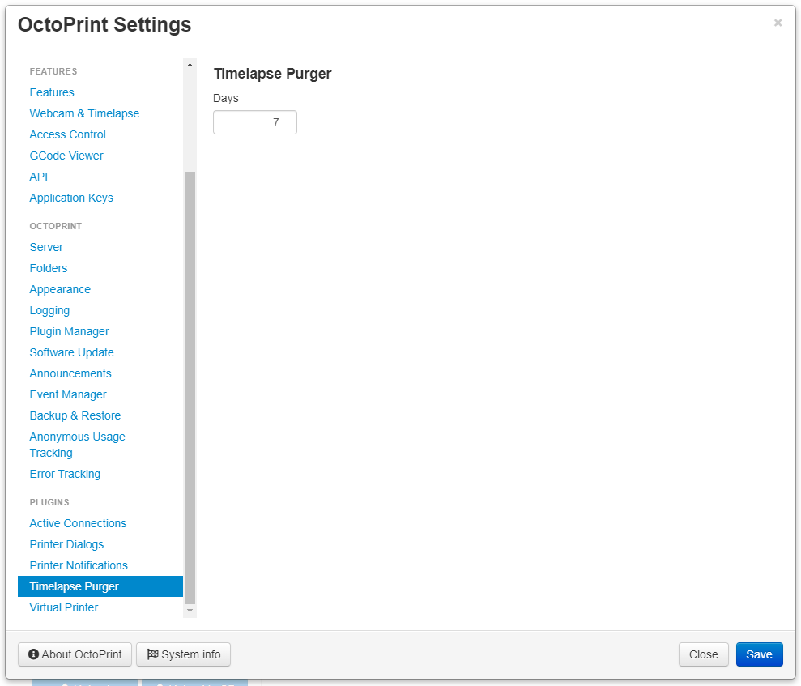

# Timelapse Purger

This plugin will automatically delete timelapse files that are older than a configured number of days.

## Setup

Install via the bundled [Plugin Manager](https://docs.octoprint.org/en/master/bundledplugins/pluginmanager.html)
or manually using this URL:

    https://github.com/jneilliii/OctoPrint-TimelapsePurger/archive/master.zip

## Configuration

Enter number of days in settings.

## Get Help

If you experience issues with this plugin or need assistance please use the issue tracker by clicking issues above.

## Additional Plugins

Check out my other plugins [here](https://plugins.octoprint.org/by_author/#jneilliii)

## Sponsors
- Andreas Lindermayr
- [@TheTuxKeeper](https://github.com/thetuxkeeper)
- [@tideline3d](https://github.com/tideline3d/)
- [SimplyPrint](https://simplyprint.io/)
- [Andrew Beeman](https://github.com/Kiendeleo)
- [Calanish](https://github.com/calanish)
- [Lachlan Bell](https://lachy.io/)
- [Jonny Bergdahl](https://github.com/bergdahl)
## Support My Efforts
I, jneilliii, programmed this plugin for fun and do my best effort to support those that have issues with it, please return the favor and leave me a tip or become a Patron if you find this plugin helpful and want me to continue future development.

 

<small>No paypal.me? Send funds via PayPal to jneilliii&#64;gmail&#46;com

You can use [this](https://www.paypal.com/cgi-bin/webscr?cmd=_xclick&business=jneilliii@gmail.com) link too. But the normal PayPal fee will be deducted.
</small>
